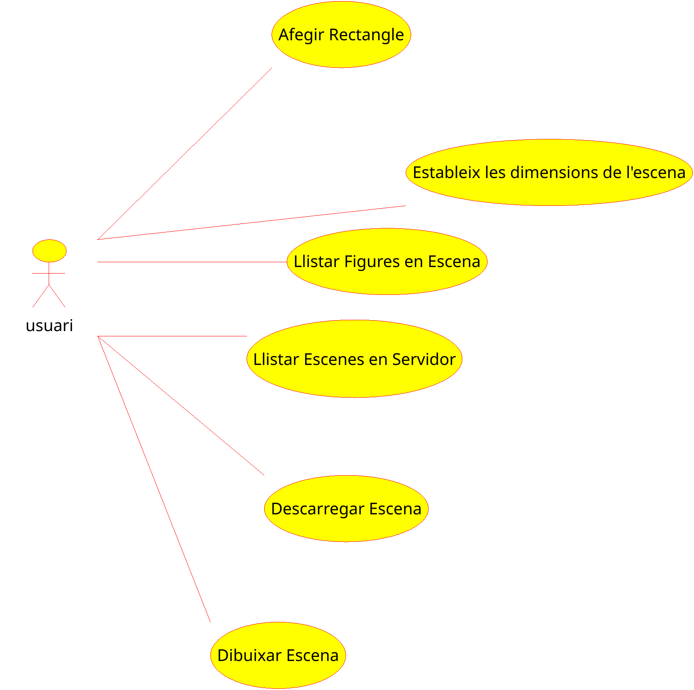

# Diagrama de casos d'ús

El diagrama de casos d'ús de l'aplicació és el següent.

Veiem la descripió de cada cas:

## Cas d'ús: SM01

**Nom**: Afegir rectangle

**Actors**: Usuari

**Descripció**

L'usuari afig un nou rectangle a l'escena.

**Precondicions**:
*cap*

**Seqüència normal**

1. L'usuari introdueix les propietats del rectangle (posició, tamany i color) en la CLI.
2. El sistema afig el rectangle a l'escena i informa l'usuari que s'ha inserit correctament.

**Postcondicions**

S'ha afegit un nou rectangle a l'escena.

**Excepcions**

1.1. Si la sintaxi no es correspon a la del rectangle, mostra un missatge avisant de l'error i mostrant la sintaxi correcta.
1.2. Si la posició del rectangle cau fora de l'àrea de dibuix, mostra un missatge d'error i no l'afig.

## Cas d'ús: SM02

**Nom**: Estableix les dimensions de l'escena

**Actors**: Usuari

**Descripció**

L'usuari pot redimensiona la grandària en píxels de l'escena.

**Precondicions**:

*cap*

**Seqüència normal**

1. L'usuari afig l'ordre i les noves dimensions de l'escena

**Postcondicions**

Les dimensions de l'escena s'han modificat.

**Excepcions**

1.1. Si la sintaxi no és correcta ho notifca a l'usuari.

## Cas d'ús: SM03

**Nom**: Llistar figures en escena

**Actors**: Usuari

**Descripció**
L'usuari obté un llistat am les diferents figures de l'escena.

**Precondicions**:

*cap*

**Seqüència normal**

1. L'usuari indica l'ordre de llistar l'escena
2. El sistema mostra una descripció de les diferents figures introduïdes a l'escena.

**Postcondicions**

*cap*

**Excepcions**

*cap*

## Cas d'ús: SM04

**Nom**: Llistar Escenes en Servidor

**Actors**: Usuari

**Descripció**

L'usuari obté un llistat de diferents figures emmagatzemades a un servidor extern.

**Precondicions**:
Es requereix d'accés a Internet per poder accedir a servidor (no es comprova prèviament al codi)

**Seqüència normal**

1. L'usuari demana la llista amb l'ordre `remotelist` a la CLI
2. El sistema es connecta al servidor i demana el llistat de fitxers
3. El sistema mostra a l'usuari els diferents fitxers oferits pel servidor

**Postcondicions**
*cap*

**Excepcions**
2.1. Si no hi ha connexió a Internet, el sistema mostrarà un missatge d'error.

## Cas d'ús: SM05

**Nom**: Descarrega Escena

**Actors**: Usuari

**Descripció**

L'usuari demana una escena al servidor, per tal de reemplaçar l'escene actual.

**Precondicions**:

Es requereix d'accés a Internet per poder accedir a servidor (no es comprova prèviament al codi)

**Seqüència normal**

1. L'usuari introdueix l'ordre `get` a la CLI, amb l'escene a decarregar
2. El sistema demana al servidor el fitxer
3. El sistema incorpora les diferents figures a la imatge, informant l'usuari de la correcta inserció.

**Postcondicions**
L'escena s'ha incorporat en el sisema

**Excepcions**
2.1. Si el fitxer no existeix, el sistema mostra nu error en la càrrega del fitxer.
3.1. Si alguna figura no està especificada correctament al fitxer, s'informarà a l'usuari i no s'afegirà a l'escena.

## Cas d'ús: SM06

**Nom**: Dibuixar Escena

**Actors**: Usuari

**Descripció**

Es dibuixa l'escena a una finestra gràfica nova.

**Precondicions**:
*cap*

**Seqüència normal**

1. L'usuari introdueix a la CLI l'ordre `render`
2. El sistema crea una finestra on dibuixa els diferents elements de l'escena.

**Postcondicions**
S'ha creat una nova finestra amb l'escena.

**Excepcions**
*cap*
